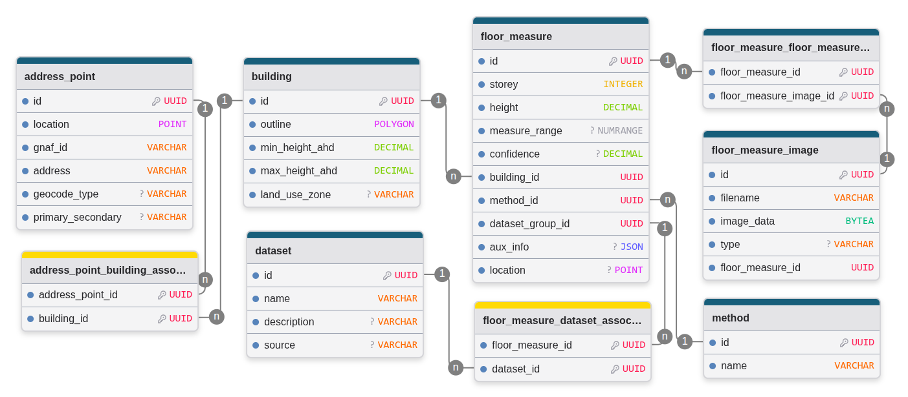

# GA Floor Heights Data Model

Data model and web application for the Geoscience Australia (GA) floor heights project. Includes;

- Model definition
  - Shown in figure below
  - Defined using ORM ([SQLAlchemy](https://www.sqlalchemy.org/))
- Migrations and tools for generating migrations based on data model changes
- Command line interface (CLI) tool to support working with the data model
- Web application for data exploration and visualisation ([Vue 3](https://vuejs.org/), [TypeScript](https://www.typescriptlang.org/), [Vite](https://vite.dev/), [FastAPI](https://fastapi.tiangolo.com/))
- Docker files to provide environment for CLI application, database and web application

## Getting started

Create the `.env` file, this includes all the environment variables used by the application. On first run, the variables are used to setup the postgres database. The variables are also used by the CLI to connect to a local or remote database.

The default values the example file should be changed (password at least).

    cp .env.example .env

Ensure the following environment variables are set:

- POSTGRES_USER - user with access to database
- POSTGRES_PASSWORD - password for user
- POSTGRES_DB - name of the database
- POSTGRES_HOST - database hostname (e.g. `localhost` if running postgres locally)
- POSTGRES_PORT - database port (e.g. `5432` if running postgres locally, but can be used for accessing a database through a SSH tunnel)

Build the docker images:

    docker compose build

Startup the containers:

    docker compose --profile dev up

Apply all database migrations, this will create the data model tables in the database:

    docker compose run --rm app alembic upgrade head

### Dev and Prod docker compose profiles

The 'dev' profile is to support development. It uses the vite dev server to host the frontend application which supports hot reloads of code. The frontend code is mounted into the container so that any changes made locally will be immediately reflected in the application. Similarly the backend is configured to run with the `--reload` argument and has the backend code mounted into the container. Any local changes made to the backend code will cause the server to reload making changed available immediately. Use the following command to start the dev mode containers, it will be available at [http://localhost:5173/](http://localhost:5173/).

    docker compose --profile dev up

The 'prod' profile supports testing a production build of the application. The frontend code is built, and copied into an nginx container where it is hosted as static html and javascript files. The backend code is copied into the container during the image build process. When these containers are run they only rely on code within the built containers so to mimic the production hosting environment. Any local changes made will require the images to be rebuilt, and restarted before any changes are available. Use the following to test the prod mode, it will be available at [http://localhost/](http://localhost/).

    docker compose --profile prod build
    docker compose --profile prod up

## Installing the python app

Create and activate a python virtual environment. e.g. using [conda](https://docs.conda.io/en/latest/):

    conda create -n floor_heights_test python=3.10
    conda activate floor_heights_test

Install an editable version of the floorheights package. Assumes this repo has been cloned already. This command should install all necessary dependencies, if that process fails, the dependencies can be installed from from [`requirements.txt`](requirements.txt) using pip.

    pip install -e .

To use the python application, the database host must be running:

    docker compose --profile dev up postgres

### Using the CLI

The CLI tool supports the ingestion and export of data to/from the data model. It can be invoked with the `fh-cli` command:

    Usage: fh-cli [OPTIONS] COMMAND [ARGS]...

    Options:
    --help  Show this message and exit.

    Commands:
    ingest-address-points        Ingest address points
    ingest-buildings             Ingest building footprints
    join-address-buildings       Join address points to building outlines
    ingest-nexis-measures        Ingest NEXIS floor height measures
    ingest-validation-measures   Ingest validation floor height measures
    download-images-s3           Download main methodology images from S3
    ingest-main-method-measures  Ingest main methodology floor height parquet
    ingest-gap-fill-measures     Ingest gap fill measures from floor height parquet
    ingest-main-method-images    Ingest main methodology images
    export-ogr-file              Export an OGR file of the data model

Specific help for each command can be shown with the `--help` option. For example, `fh-cli ingest-address-points --help`.

An example of a complete ingestion for each of the areas of interest is provided in [`./src/examples/data_ingestion_example.ipynb`](./src/examples/data_ingestion_example.ipynb) notebook.

### Using as a library

The data model can be used as a library. The following steps show one possible way to do this.

Create a `simple_select.py` file containing the following code. File can be found in [`./src/examples`](./src/examples/)

    from sqlalchemy import select
    from sqlalchemy.orm import Session
    from floorheights.datamodel.models import engine, AddressPoint

    session = Session(engine)

    sel_address_points = select(AddressPoint).limit(10)

    for ap in session.scalars(sel_address_points):
        print(str(ap))

Run the script. This will list up to 10 address points that have been added to the database.

    python simple_select.py

## Changing data model schema

Alembic is used to automatically generate database migrations scripts from changes to the SQLAlchemy model definitions. The steps required to modify the schema are as follows.

First, make changes to the SQLAlchemy model definition by changing the models defined in [`./src/floorheights/datamodel/models.py`](./src/floorheights/datamodel/models.py).

Run the following command to automatically generate a new migration script.

    docker compose run app alembic revision --autogenerate -m "notes on migration changes"

This command will generate a new file in [`./src/alembic/versions`](./src/alembic/versions/). This should be checked over to ensure it is as expected. Some migrations, for example where data may need to be migrated between tables, will require custom code. **Although programmatically generated, all migration scripts should be included in git.**

To update the database with this new migration run the following. This will run all pending migrations.

    docker compose run app alembic upgrade head

### Reverting schema changes

Say a bad migration was generated and applied to the database. The last migration can be reverted by running

    docker compose run app alembic downgrade -1

The bad migration file should then be deleted from the ['./src/alembic/versions'](./src/alembic/versions/) folder.

[Alembic provides many options for dealing with these issues](https://alembic.sqlalchemy.org/).
